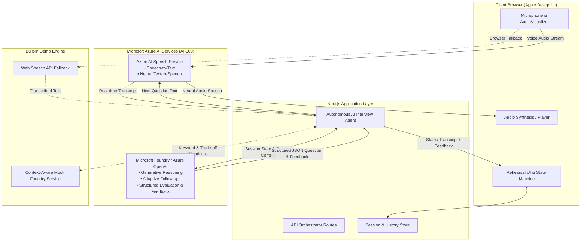

# AI Interview Coach ("Rehearse")

> **"Rehearse before the real interview."**  
> *Practice the interview, not just the questions.*

AI Interview Coach is an **Azure AI-103** project built with **Apple Design principles**. It provides an authentic, focused rehearsal environment for students and candidates to verbally rehearse interviews, experience dynamic follow-up questions from an adaptive AI interviewer, receive actionable performance feedback, and immediately rehearse again targeting identified weaknesses.

---

## Architecture Diagram



---

## 1. The Problem Being Solved

In standard interview prep, candidates memorize answers, solve isolated LeetCode algorithms, or review flashcards, but rarely practice **how they articulate and defend decisions in a live verbal conversation**. When a real engineering interviewer interrupts with an adaptive follow-up ("*Why did you choose PostgreSQL over MongoDB?*" or "*How would this scale under 100x traffic?*"), candidates frequently struggle to communicate their technical trade-offs under pressure.

**AI Interview Coach ("Rehearse")** bridges this critical gap by simulating the authentic conversational dynamics of a high-stakes technical, behavioral, or mixed interview.

---

## 2. How the AI Is Used to Solve It

Rehearse uses AI as an active conversational partner rather than a passive question bank:
1. **Conversational Neural Voice Interaction**: Rather than typing into a chatbot, candidates speak into their microphone and hear studio-grade neural voice synthesis, reproducing the sensory pressure and natural flow of a real video interview.
2. **Context-Grounded Real-Time Probing**: The AI inspects candidate answers in real time, extracts specific technologies and architectural claims (e.g. database schema, concurrency, caching, rate limiting), and poses targeted follow-up challenges.
3. **Autonomous Duration & Competency Pacing**: The autonomous agent tracks elapsed time against the scheduled duration (10m, 20m, 30m), rotating across core engineering competencies to ensure broad evaluation.
4. **Closed-Loop Deliberate Practice**: Produces diagnostic qualitative scoring across Technical Depth, Communication, and Interview Handling, and automatically seeds the candidate's diagnosed weakness into subsequent rehearsals ("Rehearse Again").

---

## 3. Azure AI-103 Concepts Applied

| # | AI-103 Capability | Technology | Implementation & Role in Product |
|---|---|---|---|
| **1** | **Speech Services** | **Azure AI Speech** | Real-time continuous Speech-to-Text (STT) for candidate responses and 24kHz 160kbps Neural Text-to-Speech (TTS) using conversational SSML prosody styling (`en-US-JennyNeural`, `GuyNeural`, etc.). |
| **2** | **Generative AI** | **Microsoft Foundry / Azure OpenAI** | Generative reasoning with `gpt-4o` / `gpt-4.1-mini`; analyzes answers against candidate context and resume data; generates structured JSON for dynamic questions, evaluation, and final feedback reports. |
| **3** | **Autonomous Agent** | **Agent State Machine** | Event-driven finite state machine orchestrating turn-taking (`idle`, `speaking`, `listening`, `thinking`), enforcing scheduled duration clock limits, rotating engineering pillars, and driving iterative rehearsal. |
| **4** | **Document Processing** | **Serverless Resume Parser** | Serverless text extraction for multi-column PDF, DOCX, and plain-text resumes to ground questions directly in candidate projects and credentials. |
| **5** | **Responsible AI & Security** | **Serverless API Proxying** | Encapsulates all cloud credentials in serverless API routes (`/api/speech`, `/api/interviews`, `/api/resume`), provides local fallback resilience, and processes video 100% client-side. |

---

## 4. End-to-End Core Functionality Demonstration

Rehearse demonstrates a complete, uninterrupted rehearsal loop:
1. **Context & Resume Grounding**: Role, Format (Technical, Behavioral, Mixed), Meeting Duration (10m, 20m, 30m), and optional PDF/DOCX resume upload.
2. **Lobby Calibration**: Live microphone audio meter check and optional local video self-view.
3. **Live Rehearsal Stage**: Active avatar states, real-time STT transcription, dynamic follow-up scrutiny, countdown timer pacing, and keyboard text fallback.
4. **Diagnostic Feedback Report**: Multi-dimensional qualitative ratings (**Technical Answers**, **Communication**, **Interview Handling**), **What Went Well**, **What to Improve**, and **Next Rehearsal Focus**.
5. **Targeted "Rehearse Again" Loop**: Carries forward candidate context and pre-seeds the next session's system prompt with the diagnosed weakness for measurable improvement.
6. **Session History & Transcript Review**: Full past session archive with question-and-answer transcripts, candidate responses, and coaching notes.

---

## 5. Design System (Apple Design Principles)

This application strictly implements the guidelines from Apple's WWDC Human Interface talks:
- **Calm & Intentional**: No "vibecoded" purple gradients, glowing blobs, floating glass cards, or gamification badges.
- **System Typography**: Optical sizing with size-specific tracking (`-0.025em` for display, `-0.015em` for headings, `normal` for body) and tight leading.
- **Restrained Color Palette**: Near-black neutral surfaces (`#000000`, `#1C1C1E`) in dark mode, clean neutrals in light mode, with warm amber (`#FF9F0A`) reserved strictly for primary interactive states.
- **Fluid & Responsive Motion**: Spring-like curves and tactile feedback (`:active { transform: scale(0.975); }`) with full `prefers-reduced-motion` support.
- **Authentic Interview Atmosphere**: Avoids chatbot bubbles or scrolling chat prompts. The candidate feels like they are in a real rehearsal conversation.

---

## 6. Product Structure & Screens

1. **Home**: Clean hero with "Start Rehearsal", "View History", and four structured pillars detailing the problem, AI solution, Azure AI-103 capabilities, and end-to-end loop.
2. **Interview Setup**: Role, Company (optional), Interview Type (Technical, Behavioural, Mixed), Duration (10m, 20m, 30m), and Resume upload / sample loader.
3. **Interview Lobby**: Readiness overview, live audio level meter check, and optional camera self-view preview for posture check.
4. **Live Interview**: Centered AI Interviewer avatar with 4 distinct subtle states (**Idle**, **Listening**, **Thinking**, **Speaking**), crisp current question display, restrained live speech peek, and finish speaking controls.
5. **Feedback Report**: 3 qualitative ratings (**Technical Answers**, **Communication**, **Interview Handling**), **What Went Well**, **What to Improve** (concrete techniques), and **Next Rehearsal Focus**.
6. **Rehearse Again**: Instant transition that pre-seeds the next rehearsal with the exact weakness identified in feedback.
7. **History & Details**: History log of past rehearsals with full question-and-answer transcripts, candidate responses, and coaching notes.
8. **Settings**: Profile, voice selection, microphone check, accessibility toggles, and Azure AI-103 diagnostic health status.

---

## 7. Quick Start (Local Setup)

### Prerequisites
- Node.js 18+ (Node 20+ recommended)
- npm 9+

### Installation
```bash
# 1. Clone repository & install dependencies
npm install

# 2. Run automated test suite
npm run test

# 3. Start development server
npm run dev
```

Open [http://localhost:3000](http://localhost:3000) in your browser.

---

## 8. Environment Variables (`.env`)

Copy `.env.example` to `.env.local`:

```bash
cp .env.example .env.local
```

Configure your Azure credentials:

```ini
# Azure AI Speech (Capability 1)
AZURE_SPEECH_KEY=your_azure_speech_resource_key
AZURE_SPEECH_REGION=eastus

# Microsoft Foundry / Azure OpenAI (Capability 2)
FOUNDRY_ENDPOINT=https://your-foundry-resource.openai.azure.com/
FOUNDRY_API_KEY=your_foundry_api_key
FOUNDRY_MODEL=gpt-4o

# Force Demo Mode (Set true to test offline without Azure credentials)
NEXT_PUBLIC_FORCE_DEMO_MODE=false
```

---

## 9. Azure Setup Guide (Step-by-Step)

### Step 1: Microsoft Foundry / Azure OpenAI Setup
1. Sign in to the [Azure Portal](https://portal.azure.com) or [Microsoft Foundry Portal](https://ai.azure.com).
2. Create an **Azure AI Services** or **Azure OpenAI** resource.
3. In the management studio, deploy a model (e.g. `gpt-4o` or `gpt-4o-mini`). Note the deployment name (e.g. `gpt-4o`).
4. Copy the **Endpoint** (e.g. `https://<resource-name>.openai.azure.com/`) and **Key 1** from **Keys and Endpoint**.
5. Set `FOUNDRY_ENDPOINT`, `FOUNDRY_API_KEY`, and `FOUNDRY_MODEL` in `.env.local`.

### Step 2: Azure AI Speech Setup
1. In Azure Portal, navigate to **Create a resource** -> **AI + Machine Learning** -> **Speech**.
2. Select your subscription, resource group, and region (e.g., `eastus`). Select the **Standard S0** pricing tier.
3. Once deployed, navigate to **Resource Management** -> **Keys and Endpoint**.
4. Copy **Key 1** and the **Location/Region**.
5. Set `AZURE_SPEECH_KEY` and `AZURE_SPEECH_REGION` in `.env.local`.

---

## 10. Reliable Demo Mode

The application is engineered with a **service abstraction layer**:
- `ISpeechService` -> `AzureSpeechService` & `MockSpeechService`
- `IFoundryService` -> `FoundryService` & `MockFoundryService`

If Azure credentials are not provided or if `NEXT_PUBLIC_FORCE_DEMO_MODE=true` is set:
- The UI displays a discreet **Demo Mode** indicator badge.
- **Real Microphone Input** is processed via the browser's native **Web Speech API** (`SpeechRecognition`), allowing real speech to be spoken and transcribed.
- **Audio Output** is rendered via the browser's native `speechSynthesis`.
- **Reasoning & Adaptive Follow-ups** are powered by the context-aware `MockFoundryService`, evaluating responses against the candidate's chosen role, technical stack, and resume.

---

## 11. Default Demo Script (3–5 Minute Walkthrough)

To present the application for an Azure AI-103 evaluation:

1. **Open Rehearse**: Notice the calm Apple-inspired design and mode badge.
2. **Start Rehearsal**:
   - Role: `Software Engineer Intern`
   - Company: `Microsoft`
   - Type: `Technical`
   - Duration: `10 min`
   - Click **+ Load Sample Resume** (Alex Chen, React + Node + PostgreSQL)
3. **Interview Lobby**: Observe the live microphone audio check meter and optional camera preview. Click **Start Interview**.
4. **Introduction & Question 1**:
   - AI speaks: *"Hi, I will be conducting your technical rehearsal today... Tell me about a technical project you have worked on recently, and one challenging engineering decision you had to make."*
5. **Answer 1**:
   - Candidate speaks (or selects shortcut): *"I built a food delivery application using React, Node, and PostgreSQL. One challenging decision was selecting our relational database schema."*
   - Click **Finish Speaking**.
6. **Adaptive Follow-Up 1**:
   - AI transitions to **Thinking**, evaluates the answer, and asks a direct contextual follow-up:
   - *"Why did you choose PostgreSQL for that project instead of a NoSQL store like MongoDB or DynamoDB?"*
7. **Answer 2**:
   - Candidate speaks: *"We needed relational data for users and orders with strict ACID transaction guarantees so orders were never lost."*
   - Click **Finish Speaking**.
8. **Deepened Follow-Up 2**:
   - AI adapts difficulty: *"How would you evolve your database schema and indexing strategy if the active user base and concurrent transactions scaled by 100x?"*
9. **Answer 3**:
   - Candidate speaks: *"I would introduce read replicas, partition historical order tables by month, and add an in-memory Redis cache for active menus."*
10. **Feedback Report**:
    - AI concludes and generates report:
    - **Technical Answers**: Strong
    - **Communication**: Good
    - **Interview Handling**: Good
    - **What Went Well**: Concrete technical details on ACID transactions and scaling.
    - **What to Improve**: Actionable techniques (e.g. contrast alternative options, structure scaling answers).
    - **Next Rehearsal Focus**: *"Technical reasoning and architectural trade-offs."*
11. **Rehearse Again**:
    - Click **Rehearse Again**.
    - Notice that the new rehearsal pre-seeds with: *"Targeting Prior Weakness: Technical reasoning and architectural trade-offs"*.
    - The AI's opening question immediately pivots to probe technical trade-offs.

---

## 12. Automated Tests

The repository contains test suites verifying the interview agent loop, state transitions, dynamic follow-up heuristics, and edge cases:

```bash
npm run test
```

### Verified Scenarios:
- Role & Context-aware opening question generation
- Keyword-based adaptive follow-up generation (PostgreSQL, React, Node, Teamwork)
- Multi-round agent lifecycle and context maintenance across turns
- Pre-seeding next rehearsal based on feedback weaknesses
- Graceful handling of empty or brief answers
- Speech service demo mode isolation

---

## 13. Known Limitations & Future Scope

### V1 Scope Limitations
- Focused exclusively on the interview conversation rehearsal loop.
- No recruiter portal, job marketplace, or applicant tracking system (intentionally excluded).
- No speculative emotion or personality detection claims (focus is solely on observable verbal answers).

### Future Roadmap
- Additional multilingual speech voices for regional rehearsals.
- Exportable PDF feedback reports for career advisors.
- Custom system prompt fine-tuning per engineering subdiscipline (e.g., ML Engineering, SRE).
