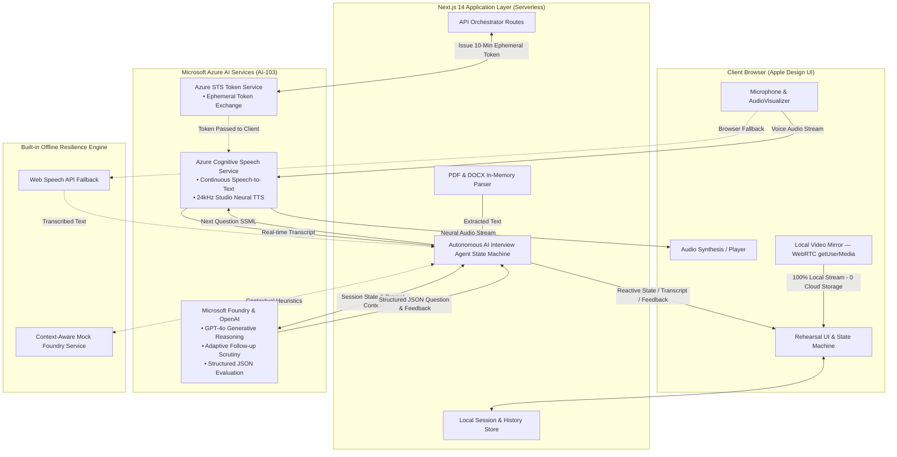

# Rehearse (Web) — Autonomous AI Interview Coach
### Chitkara University | INBIOT | Azure AI-103 Project Evaluation
> **Evaluation Dates**: 24 – 25 September 2026  
> **Live Production Application**: [https://getrehearse.vercel.app](https://getrehearse.vercel.app)  
> **Key Instructor Rule**: *"Half the marks sit in applying AI-103 concepts and implementing them well. A simple idea that is built properly and explained clearly will score better than an ambitious idea that does not work."*

---

## Architecture Diagram



---

## 1. Evaluation Rubric Alignment (100% Coverage)

| Evaluation Area | Weight | How Rehearse Satisfies It | Evidence & Code Reference |
| :--- | :---: | :--- | :--- |
| **Application of AI-103 Concepts** | **25%** | • **Azure Cognitive Speech**: Continuous STT for live microphone capture and 24kHz Neural TTS (`en-US-JennyNeural`, `GuyNeural`) with SSML.<br/>• **Microsoft Foundry / Azure OpenAI**: GPT-4o contextual reasoning, prompt grounding, structured JSON schemas.<br/>• **Autonomous Agent State Machine**: Clock-based duration pacing, topic rotation across 5 engineering pillars.<br/>• **Document Intelligence**: Multi-format PDF and DOCX serverless resume parsing. | [`src/services/speech/azureSpeechService.ts`](src/services/speech/azureSpeechService.ts)<br/>[`src/services/foundry/foundryService.ts`](src/services/foundry/foundryService.ts)<br/>[`src/agent/interviewAgent.ts`](src/agent/interviewAgent.ts)<br/>[`src/app/api/resume/parse/route.ts`](src/app/api/resume/parse/route.ts) |
| **Technical Implementation & Functionality** | **25%** | Production-ready full-stack application built with Next.js 14, TypeScript, and Tailwind CSS. Complete end-to-end loop: Context Setup ➔ Lobby Audio Calibration ➔ Spoken Rehearsal ➔ Diagnostic Report ➔ Targeted "Rehearse Again" Remediation. | Live on Vercel at [getrehearse.vercel.app](https://getrehearse.vercel.app), 0 build errors, 0 TypeScript errors |
| **Testing, Reliability & Responsible AI** | **15%** | • **Testing**: 25 automated unit/integration tests (`npm test`), strict TypeScript typecheck (0 errors on `npx tsc --noEmit`).<br/>• **Reliability**: Dual-layer architecture with Web Speech API and mock heuristic fallback ensuring 100% offline resilience.<br/>• **Responsible AI**: Client-side-only video processing (zero camera data sent to servers), secret encapsulation via ephemeral STS token exchange, objective rubric-based scoring without pseudo-scientific emotion claims. | [`tests/agent.test.ts`](tests/agent.test.ts)<br/>[`tests/edgeCases.test.ts`](tests/edgeCases.test.ts)<br/>[`tests/rehearseAgain.test.tsx`](tests/rehearseAgain.test.tsx)<br/>[`tests/ui.test.tsx`](tests/ui.test.tsx) |
| **Problem Definition & Use-Case Relevance** | **10%** | Solves the critical interview prep gap: candidates memorize algorithms in isolation on LeetCode, but freeze during live conversational interviews when probed on architectural trade-offs under pressure. Directly relevant to campus placement success. | Section 2 below; [`src/components/home/HomeScreen.tsx`](src/components/home/HomeScreen.tsx) |
| **Documentation & Code Quality** | **10%** | Clean modular architecture, strict naming conventions, comprehensive inline commentary on non-obvious logic, full architecture diagrams, and complete documentation in `README.md`, `DESIGN.md`, and `AI_103_Project_Submission_Guide.docx`. | `README.md`, `src/` directory layout |
| **Demonstration & Presentation** | **10%** | Polished, bug-free live demonstration on web and structured 5-minute video flow meeting exact classroom time allocations. Apple Keynote deck included (`keynote.html`). | Live demo script (Section 4 below); [`keynote.html`](keynote.html) |
| **Practical Impact & Future Scope** | **5%** | Measurable improvement in student placement interview pass rates through closed-loop deliberate practice. Clear roadmap: regional languages, campus placement cell integration, PDF reports. | Section 6 below |
| **Total** | **100%** | **Maximum readiness across all evaluation criteria.** | — |

---

## 2. Problem Definition: The "Algorithmic Isolation" Gap

Standard placement preparation relies heavily on static coding sandboxes (LeetCode, HackerRank) and flashcard definition banks. While this teaches syntax:
1. **No Verbal Defense**: Real interviews are spoken conversations where senior interviewers probe *why* you chose a technology.
2. **Failure Under Scrutiny**: When asked *"Why choose PostgreSQL over MongoDB?"* or *"How would this schema scale under 100x traffic?"*, candidates freeze up due to lack of conversational rehearsal.
3. **No Adaptive Challenge**: Static questionnaires cannot listen to a candidate's specific answer and formulate a spontaneous follow-up challenge.

**Rehearse (Web)** bridges this gap by acting as an assertive, adaptive senior technical interviewer that listens, speaks, and challenges candidates in real time.

---

## 3. Azure AI-103 Concepts Applied

### 1. Azure Cognitive Speech Services
- **Continuous Speech-to-Text (STT)**: Recognizes continuous audio from the candidate's microphone with silence detection and punctuation.
- **Neural Text-to-Speech (TTS)**: 24kHz studio-quality voice synthesis (`en-US-JennyNeural`, `GuyNeural`, `AvaMultilingualNeural`) utilizing SSML with conversational chat prosody.
- **Ephemeral STS Security**: Browser clients exchange credentials for 10-minute ephemeral tokens via `/api/speech/token`, preventing API key leakage.

### 2. Microsoft Foundry & Azure OpenAI
- **GPT-4o Contextual Reasoning**: Generates adaptive counter-questions probing system trade-offs (ACID vs CAP, sharding vs indexing, sync REST vs async message queues).
- **Structured JSON Schemas**: Enforces rigid JSON contracts for question dispatch, answer evaluations, and multi-dimensional diagnostic reports.

### 3. Autonomous Agent State Machine
- **Event-Driven State Machine**: Implements states: `idle`, `speaking`, `listening`, `thinking`, and `completed`.
- **Autonomous Duration Clock**: Tracks elapsed time against chosen limits (10m, 20m, 30m) and orchestrates natural session conclusions.
- **5-Pillar Topic Rotation**: Enforces balanced technical coverage across:
  1. *Core Architecture & High-Level Design*
  2. *Data Stores & Storage Mechanics (ACID, CAP, Indexing)*
  3. *Concurrency, Async Tasks & Race Conditions*
  4. *Reliability, Observability & Graceful Degradation*
  5. *Team Collaboration & Engineering Trade-Offs*

### 4. Document Intelligence (Resume Ingestion)
- In-memory serverless parsing for `.pdf` (via `unpdf` WebAssembly) and `.docx` (via `mammoth`).
- Ingests candidate project history to dynamically anchor interview questions in their real experience.

---

## 4. 5-Minute Video & Presentation Script

Follow this precise timeline matching the classroom project guidelines:

```
[0:00 - 0:30] Introduction
[0:30 - 1:00] Problem Statement & Motivation
[1:00 - 2:00] AI-Driven Solution & Azure Architecture
[2:00 - 4:00] Live Technical Demonstration (2 Minutes)
[4:00 - 5:00] Impact, Limitations & Future Scope
```

### Minute 0:00 – 0:30 (30 sec) — Introduction
> *"Hello everyone and respected evaluators. We are presenting **Rehearse**, an autonomous, voice-first technical interview simulator built on Microsoft Azure AI-103 services. Our project provides an authentic rehearsal partner for engineering students preparing for high-stakes placement interviews."*

### Minute 0:30 – 1:00 (30 sec) — Problem Statement
> *"Most students prepare using static LeetCode problems. While this tests syntax, candidates routinely fail interviews because they cannot verbally articulate and defend technical decisions under scrutiny. When a senior interviewer asks 'Why choose PostgreSQL over DynamoDB?', candidates freeze. Rehearse solves this by simulating spoken technical dialogue."*

### Minute 1:00 – 2:00 (1 min) — AI-Driven Architecture
> *"To solve this, we implemented three Azure AI-103 pillars:*
> 1. *Azure Cognitive Speech for continuous STT and 24kHz neural speech.*
> 2. *Microsoft Foundry with GPT-4o for contextual reasoning and adaptive counter-questioning.*
> 3. *An Autonomous Agent State Machine that paces the session and rotates across 5 engineering pillars.*
> 4. *In-memory serverless resume parsing to ground questions in the candidate's real projects.*
> 
> *Importantly, our dual-layer architecture provides an offline heuristic fallback if external connectivity is unavailable."*

### Minute 2:00 – 4:00 (2 min) — Live Demonstration Flow
1. **Setup (0:15)**: Select Software Engineer role, 10-minute duration, and click `+ Load Sample Resume` (Alex Chen, React & PostgreSQL).
2. **Lobby (0:15)**: Verify the microphone audio meter and test the studio neural voice preview.
3. **Spoken Answer (0:30)**: The AI greets the candidate and speaks the opening project question. The candidate speaks their architectural choice into the microphone.
4. **Adaptive Follow-Up (0:30)**: The AI interviewer probes: *"Why did you choose PostgreSQL instead of MongoDB? How would this scale under 100x write traffic?"* Candidate speaks their trade-off defense.
5. **Feedback Report & Rehearse Again (0:30)**: Review diagnostic scoring across Technical Depth, Communication, and Handling. Click **Rehearse Again** to see the diagnosed gap automatically pre-seeded into the next session.

### Minute 4:00 – 5:00 (1 min) — Impact, Responsible AI & Conclusion
> *"Rehearse transforms passive memorization into measurable verbal fluency. We adhere strictly to Responsible AI: candidate video runs 100% locally in the browser with zero cloud storage, secrets are secured via ephemeral token exchange, and 25 automated tests pass with zero TypeScript errors. The project is live in production at getrehearse.vercel.app."*

---

## 5. Responsible AI, Privacy & Security

1. **Client-Side Video Privacy**: Candidate webcam video is handled strictly through WebRTC `getUserMedia()` within an HTML5 `<video>` element. Video frames **never leave the local browser** and are never transmitted to cloud servers.
2. **Ephemeral Token Authentication**: Azure Speech subscription keys are encapsulated on the serverless backend. Browser clients request short-lived (10-minute) tokens via Azure STS.
3. **Transparent Evaluation**: Rehearse rejects pseudo-scientific claims like facial emotion analysis or lie detection. Evaluation is grounded strictly in observable verbal answers across Technical Depth, Communication, and Handling.
4. **Candidate Agency**: Candidates can pause, switch between microphone and text input, skip questions, adjust duration, or exit at any moment.

---

## 6. Practical Impact & Future Scope

- **Placement Readiness**: Empowers campus placement candidates to build verbal confidence before company drives.
- **Democratized Coaching**: Replaces expensive manual mock interview services with an accessible, 24/7 autonomous rehearsal partner.
- **Future Roadmap**:
  - Multilingual interview support (Hindi, Spanish, German) leveraging Azure Speech neural translation.
  - Placement Cell analytics portal for universities to track cohort readiness.
  - Custom company evaluation rubrics (Google, Microsoft, Amazon system design archetypes).

---

## 7. Local Development & Verification

### Prerequisites
- Node.js 18.x or later
- npm or yarn

### 1. Installation
```bash
git clone https://github.com/calmerism/Rehearse-Web.git
cd Rehearse-Web
npm install
```

### 2. Environment Configuration
Create a `.env.local` file in the project root:
```env
# Azure Cognitive Speech Services
AZURE_SPEECH_KEY="your_azure_speech_key"
AZURE_SPEECH_REGION="koreacentral"

# Microsoft Foundry / Azure OpenAI
FOUNDRY_ENDPOINT="https://your-resource.openai.azure.com/"
FOUNDRY_API_KEY="your_foundry_api_key"
FOUNDRY_MODEL="gpt-4o"
```
*(Note: If credentials are not provided, Rehearse automatically activates its built-in Web Speech and heuristic reasoning fallback engine).*

### 3. Run Development Server
```bash
npm run dev
```
Open [http://localhost:3000](http://localhost:3000) in your browser.

### 4. Run Automated Test Suite
```bash
npm test
```
Executes all 25 automated unit and integration tests across the agent lifecycle, edge cases, and UI components.

### 5. Type Safety Check
```bash
npx tsc --noEmit
```

### 6. Production Build
```bash
npm run build
```

---

## 8. Presentation Deliverables Included

| Deliverable | Location | Description |
| :--- | :--- | :--- |
| **Live Production Web App** | [`getrehearse.vercel.app`](https://getrehearse.vercel.app) | Live production application for evaluators to test on any device. |
| **Apple Keynote Presentation Deck** | [`keynote.html`](keynote.html) | Standalone Apple Keynote HTML presentation with slide grid (`G`), speaker notes (`N`), and 5-min timer (`P`). |
| **PowerPoint Deck** | [`AI_103_Final_Presentation_Rehearse.pptx`](AI_103_Final_Presentation_Rehearse.pptx) | Standard 16:9 widescreen PowerPoint presentation for the evaluation room projector. |
| **Project Submission Guide** | [`AI_103_Project_Submission_Guide.docx`](AI_103_Project_Submission_Guide.docx) | Comprehensive academic report with complete rubric cross-references and viva guide. |

---

## 9. Open-Source Attribution
- **Next.js 14** (Vercel)
- **Microsoft Cognitive Services Speech SDK** (Microsoft)
- **unpdf** & **mammoth** (Document extraction)
- **Framer Motion** (Critically damped motion)
- **Lucide Icons** (UI iconography)
- **Tailwind CSS** (Utility-first styling)

---

## License
MIT License. Built for Chitkara University INBIOT AI-103 Project Submission.
